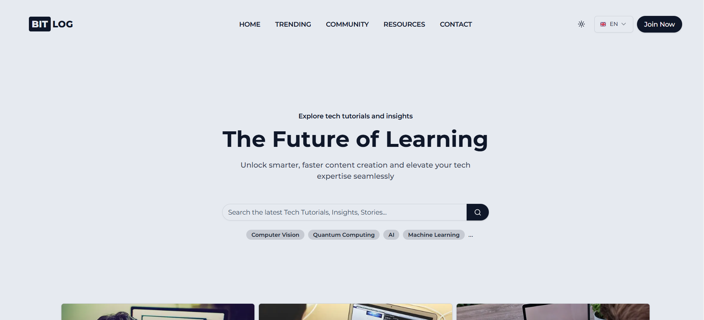

# [BITLOG: The Future of Learning](https://bitlog.netlify.app)

**[BITLOG](https://bitlog.netlify.app)** is a blog platform designed to deliver high-quality tutorials, insights, and tech stories to empower developers and foster a vibrant tech community. It combines advanced features and tools to create a seamless user experience for learners and content creators alike.



## Table of Contents

1. [Introduction](#introduction)
2. [Features](#features)
3. [Tech Stack](#tech-stack)
4. [Installation](#installation)
5. [Running the Project](#running-the-project)
6. [Deploying](#deploying)
7. [Contributing](#contributing)
8. [License](#license)

## Introduction

[BITLOG](https://bitlog.netlify.app) is a modern learning blog platform designed to provide developers with resources such as in-depth tutorials, real-world tech stories, and AI-powered tools. This README provides a comprehensive guide to setting up, running, and contributing to the project.

## Features

### Frontend

✅ Responsive Design  
✅ Dark Mode Toggle  
✅ English and German Language Support  
✅ Interactive User Interface  
❌ Progressive Web App (PWA) Support  
❌ Modular Component Architecture  
❌ Accessibility (WCAG Standards)  
❌ Dark Theme Design  
❌ Multi-language Expansion (French, Spanish, etc.)  
❌ Interactive Charts and Graphs  
❌ File Upload with Preview  
❌ Drag-and-Drop Interface  
❌ Real-Time Notifications  
❌ Context-Sensitive Help

### Authentication

✅ Login  
✅ Register  
✅ Email Verification  
✅ Forgot Password  
✅ Verify User  
✅ OAuth Providers (Google, GitHub, Twitter, Discord, Passkey)  
✅ Session Management  
✅ User Role Assignment  
❌ Two-Factor Authentication  
❌ Social Sign-On Enhancements

### Core Features

✅ User Database Integration  
✅ Contact Page  
❌ Optimised SEO  
❌ Search and Filter Options  
❌ User Activity Tracking  
❌ Newsletter Subscription  
❌ Blog Editor with Markdown Support  
❌ User Dashboard:

- ❌ Add Content
- ❌ Edit Content
- ❌ Advanced User Settings  
  ❌ Personalized Recommendations  
  ❌ Notification Preferences

### AI-Powered Tools

❌ Text Completion Tool (Beta)  
❌ Blog Generator  
❌ Template Generator  
❌ Image Generator  
❌ Code Snippet Generator  
❌ Text Summarizer  
❌ Chatbot Integration  
❌ Sentiment Analysis Tool  
❌ AI Content Optimization

### Payment Integration

❌ Free Tier Access  
❌ Stripe Integration  
❌ PayPal Integration  
❌ Subscription Management  
❌ Donation Support  
❌ Tiered Pricing Plans

### Collaboration Tools

❌ Real-Time Collaboration  
❌ Shared Workspaces  
❌ Content Approval Workflows  
❌ Version Control for Content

### Additional Features

❌ Social Media Integration (Basic)  
❌ Social Media Sharing  
❌ Bookmark and Favorites  
❌ Real-Time Collaboration  
❌ Role-Based Access Control  
❌ Content Scheduling  
❌ Analytics Dashboard  
❌ Customizable Themes  
❌ Offline Mode  
❌ API for Third-Party Integration  
❌ Gamification (Badges, Points)  
❌ Community Forums  
❌ User Feedback Mechanisms  
❌ Comprehensive Reporting Tools

## Tech Stack

- **Frontend**: Next.js, React, TypeScript
- **Styling**: Tailwind CSS, Shadcn
- **Database**: Drizzle ORM, Neon PostgreSQL
- **Authentication**: NextAuth.js
- **AI Tools**: (currently being explored)
- **Deployment**: Vercel, Docker
- **Version Control**: Git, GitHub

## Installation

Follow these steps to set up the project locally:

1. Clone the repository:
   ```bash
   git clone https://github.com/Anujjoshi3105/bitlog.git
   ```
2. Navigate to the project directory:
   ```bash
   cd bitlog
   ```
3. Install dependencies:
   ```bash
   npm install
   ```

## Running the Project

1. Start the development server:
   ```bash
   npm run dev
   ```
2. Open your browser and navigate to `http://localhost:3000`.

## Deploying

1. Build the project for production:
   ```bash
   npm run build
   ```
2. Deploy the build to your hosting provider (e.g., Vercel, Netlify).

## Contributing

Contributions are welcome! Here's how you can get started:

1. Fork the repository.
2. Create a new branch:
   ```bash
   git checkout -b feature-name
   ```
3. Commit your changes:
   ```bash
   git commit -m 'Add new feature'
   ```
4. Push to your branch:
   ```bash
   git push origin feature-name
   ```
5. Open a Pull Request on GitHub.

## License

This project is licensed under the MIT License. See the `LICENSE` file for more details.
